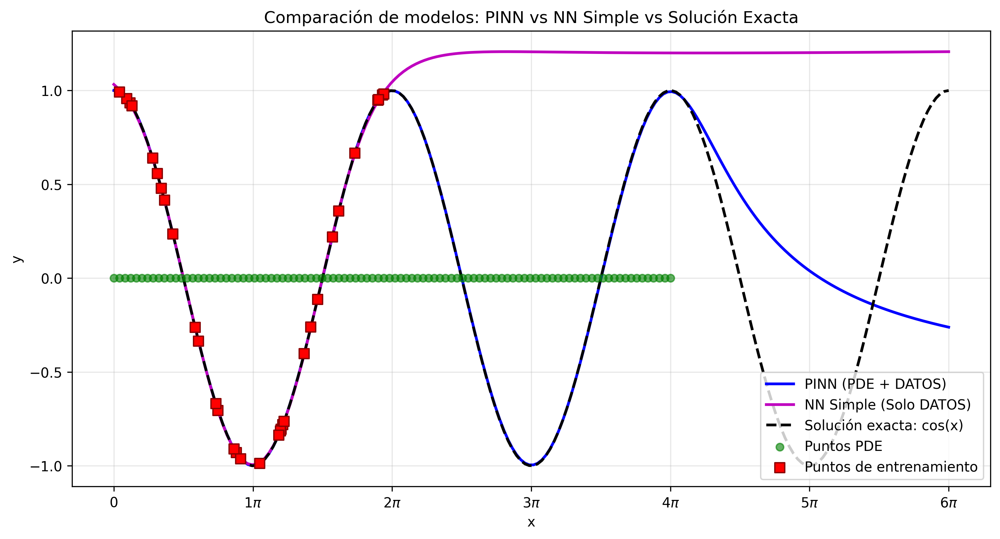
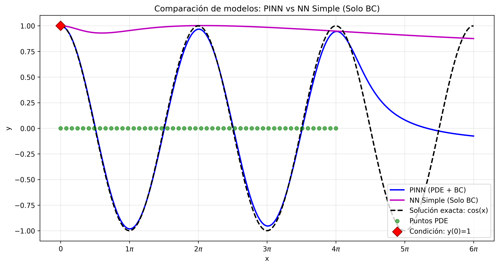
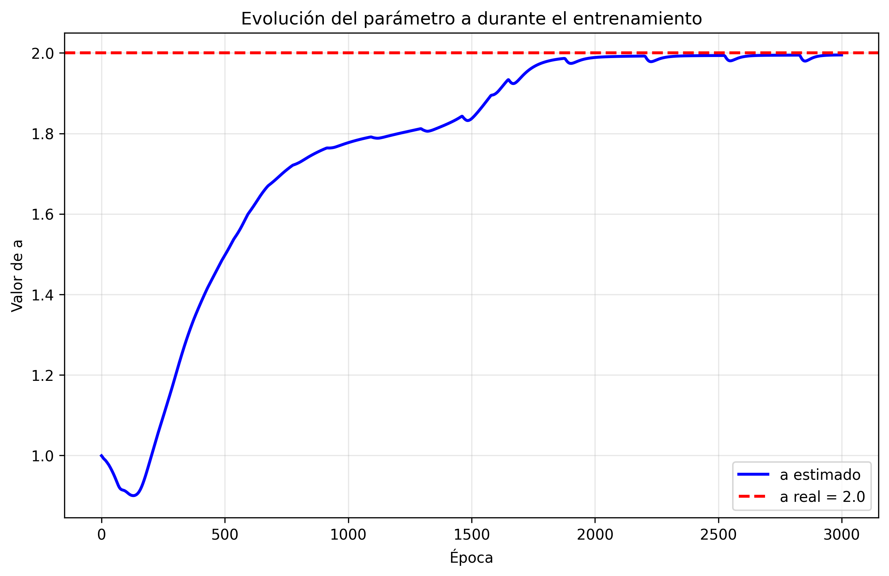

# ODE_HO

Solving the harmonic oscillator equation using **PINNs**: comparison with standard neural networks and exploration of inverse problems.

This repository contains the code developed to solve a second-order ordinary differential equation (ODE) using **Physics-Informed Neural Networks (PINNs)**. It includes comparisons with standard neural networks using different datasets, as well as an example of an inverse problem.

## Repository Contents

- `case_1.py`: Code for Case 1 with abundant data.
- `case_2.py`: Code for Case 2 with minimal data.
- `case_3.py`: Code for Case 3 using boundary conditions.
- `inverse_problem.py`: Solves the inverse problem where the parameter `$a$` is learned.
- `README.md`: Project documentation.

## Validation of PINNs as a tool to solve ODE

We consider the following ODE:

$$
\frac{d^2y}{dx^2} + y = 0
$$

Boundary conditions:

$$
y(0) = 1, \quad y'(0) = 0
$$

The exact solution is:

$$
y(x) = \cos(x)
$$

To explore the capability of Physics-Informed Neural Networks compared to ordinary Neural Networks, we analyze three different cases:

- **Case 1:** abundant training points in the domain $[0, 2\pi]$. We evaluate extrapolation ability outside the training domain.
- **Case 2:** minimal training points in the domain $[0, 2\pi]$, testing accuracy with limited data.
- **Case 3:** training using only boundary conditions (BC).

For all cases, the following architecture and hyperparameters are used:

| Parameter             | Value         |
|-----------------------|---------------|
| Number of layers      | 5             |
| Neurons per layer     | 32            |
| Activation function   | Tanh          |
| Learning rate         | 1e-3          |
| Optimizer             | Adam          |
| Number of epochs      | 3000          |
| PDE points            | 100           |

The loss function is composed of data and PDE parts. The PINN optimizes both, while the standard NN optimizes only the data part:

$$
\mathcal{L} = \lambda_{\text{DATA}} L_{\text{DATA}} + \lambda_{\text{PDE}} L_{\text{PDE}}
$$

where **$L_{\text{DATA}}$** measures the error on experimental data, and **$L_{\text{PDE}}$** is the residual of the differential equation evaluated at collocation points. The weights are fixed as $\lambda_{\text{DATA}} = \lambda_{\text{PDE}} = 0.5$, giving equal importance to both terms.

## Results

### Case 1: Abundant training data in $[0, 2\pi]$ (`case_1.py`)

| Interval              | PINN MSE    | Simple NN MSE  |
|-----------------------|-------------|----------------|
| Training $[0, 2\pi]$        | 0           | 0.00007        |
| Extrapolation $[2\pi, 4\pi]$ | 0.00002     | 1.92391        |

---

### Case 2: Minimal training data in $[0, 2\pi]$ (`case_2.py`)

| Interval              | PINN MSE    | Simple NN MSE  |
|-----------------------|-------------|----------------|
| Training $[0, 2\pi]$         | 0           | 1.99689        |
| Extrapolation $[2\pi, 4\pi]$ | 0           | 5.13736        |

---

### Case 3: Only boundary conditions at $x = 0$ (`case_3.py`)

| Interval              | PINN MSE    | Simple NN MSE  |
|-----------------------|-------------|----------------|
| Training $[0, 2\pi]$        | 0.00048     | 1.40306        |
| Extrapolation $[2\pi, 4\pi]$ | 0.00161     | 1.43553        |

## Validation of PINNs as a tool to solve inverse problems

We now explore the ability of PINNs to solve inverse problems:

Consider the ODE:

$$
\frac{d^2y}{dx^2} + a \, y = 0
$$

Boundary conditions:

$$
y(0) = 1, \quad y'(0) = 0
$$

Exact solution:

$$
y(x) = \cos(\sqrt{a} \, x)
$$

The constant `$a$` is assigned an arbitrary value (e.g., $a = 2$) when generating data points. Inside the `PINN` class, `$a$` is defined as a trainable parameter. During training, the network learns both weights/biases and the unknown physical parameter `$a$`.  

We initialize `$a$` with an incorrect value (e.g., $a = 1$) to test whether the PINN can optimize it toward the correct value through training epochs.

