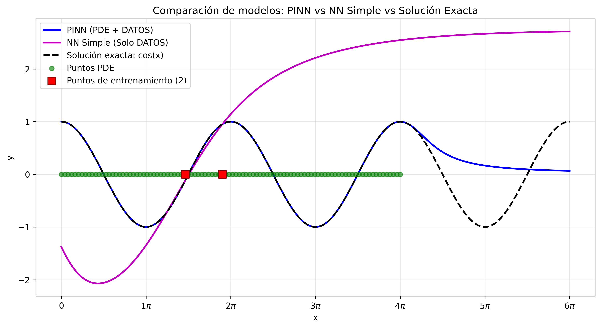

# ODE_HO  
Solving the harmonic oscillator equation using PINNs: comparison with standard neural networks and exploration of inverse problems.

This repository contains the code developed to solve a second-order ordinary differential equation (ODE) using **Physics-Informed Neural Networks (PINNs)**. It includes comparisons with standard neural networks using different datasets, as well as an example of an inverse problem.

## Repository Contents

- `case_1.py`: Code for Case 1 with abundant data.
- `case_2.py`: Code for Case 2 with minimal data.
- `case_3.py`: Code for Case 3 using boundary conditions.
- `inverse_problem.py`: Solves the inverse problem where the parameter 'a' is learned.
- `README.md`: Project documentation.
- 
## Code Functionality

Each script defines and trains a Physics-Informed Neural Network (PINN) as well as an ordinary Neural Network to solve a specific differential equation problem. The PINN architecture, loss function, training procedure, and evaluation are implemented directly in the script.

To run each case, simply execute the corresponding `.py` file. The script will:

1. Define the neural network architecture.
2. Set up the loss function using data points and the residual of the differential equation.
3. Train the PINN using gradient-based optimization.
4. Evaluate the trained model and generate the graphics.

We consider the following ODE:

d²y/dx² + y = 0  
Boundary conditions:  
y(0) = 1  
y'(0) = 0

The exact solution is:  
y(x) = cos(x)

To explore the capability of Physics-Informed Neural Networks compared to ordinary Neural Networks, we analyze three different cases:

- **Case 1:** abundant training points in the domain [0, 2π]. We evaluate extrapolation ability outside the training domain.
- **Case 2:** minimal training points in the domain [0, 2π], testing accuracy with limited data.
- **Case 3:** training using only boundary conditions (BC).

For all cases, the following architecture and hyperparameters are used:

| Parameter             | Value         |
|-----------------------|---------------|
| Number of layers      | 5             |
| Neurons per layer     | 32            |
| Activation function   | Tanh          |
| Learning rate         | 1e-3          |
| Optimizer             | Adam          |
| Number of epochs      | 3000          |
| PDE points            | 100           |

The loss function is composed of data and PDE parts. The PINN optimizes both, while the standard NN optimizes only the data part:

L = λ_DATA × L_DATA + λ_PDE × L_PDE

where **L_DATA** measures the error on experimental data, and **L_PDE** is the residual of the differential equation evaluated at collocation points. The weights are fixed as λ_DATA = λ_PDE = 0.5, giving equal importance to both terms.
---

## Results

### Case 1: Abundant training data in [0, 2π] (`case_1.py`)

| Interval              | PINN MSE    | Simple NN MSE  |
|-----------------------|-------------|----------------|
| Training \([0, 2\pi]\)         | 0           | 0.00007        |
| Extrapolation \([2\pi, 4\pi]\) | 0.00002     | 1.92391        |

---

### Case 2: Minimal training data in [0, 2π] (`case_2.py`)

| Interval              | PINN MSE    | Simple NN MSE  |
|-----------------------|-------------|----------------|
| Training \([0, 2\pi]\)         | 0           | 1.99689        |
| Extrapolation \([2\pi, 4\pi]\) | 0           | 5.13736        |

---

### Case 3: Only boundary conditions at \(x = 0\) (`case_3.py`)

| Interval              | PINN MSE    | Simple NN MSE  |
|-----------------------|-------------|----------------|
| Training \([0, 2\pi]\)         | 0.00048     | 1.40306        |
| Extrapolation \([2\pi, 4\pi]\) | 0.00161     | 1.43553        |

After validating PINNs as a tool to solve differential equations, we now explore their ability to solve inverse problems.

We will consider the following ordinary differential equation (ODE):

d²y/dx² + a·y = 0  
Boundary conditions:  
y(0) = 1  
y′(0) = 0

The exact solution is:  
y(x) = cos(√a · x)

We assign the constant 'a' an arbitrary value (e.g., a = 2) when generating data points using the analytical solution. We then define 'a' as a trainable parameter inside the `PINN` class. In this way, the network is not only learning the typical parameters (weights and biases), but also the unknown physical parameter 'a'.

During training, the PINN attempts to find the values of all parameters (including 'a') that minimize the loss function. We initialize 'a' with an incorrect value (e.g., a = 1) to test whether the PINN can learn the correct value through optimization over the epochs.

****
